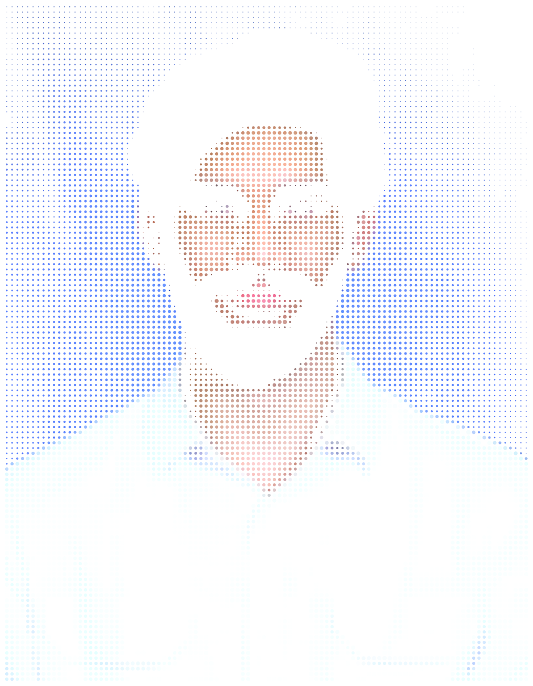
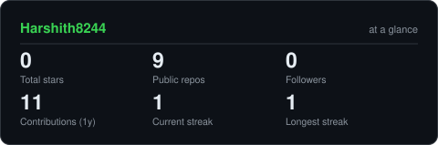
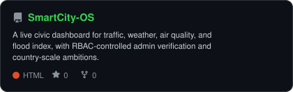
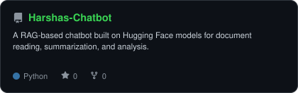
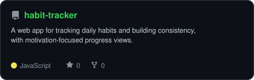
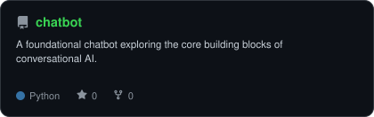

<div align="center">

<!-- PORTRAIT - generated by scripts/dotify.py from me_raw.jpg.
     Colour mode, so one file serves both GitHub themes. Regenerate with:
       python scripts/dotify.py me_raw.jpg -o assets/portrait \
         --cols 100 --equalize --detail 0.5 --color -->


<br>

<!-- NAME / TAGLINE - animated typing -->
<a href="https://github.com/Harshith8244">
  
</a>

<br>

<!-- SOCIALS -->
<a href="https://www.linkedin.com/in/harshith-dangeti-55a6b8375"></a>
<a href="mailto:harshithdangeti@gmail.com"></a>


</div>

---

## `~/` whoami

```console
$ cat about.txt
```

Hi, I'm **Harshith Dangeti**. I'm a full-stack developer who builds web and mobile features end-to-end,
and I'm growing my skills toward AI/ML on the side.

- Currently building **[SmartCity-OS](https://github.com/Harshith8244/SmartCity-OS)** and **[Harshas-Chatbot](https://github.com/Harshith8244/Harshas-Chatbot)**
- Learning **React Native** and growing into **AI/ML**
- Fun fact: **I measure the difficulty of a bug by how many cups of coffee it takes to fix it.**

<br>

<div align="center">

## `~/` toolbox


</div>

---

<div align="center">

## `~/` skill radar

<table>
<tr>
<td width="50%" align="center" valign="middle">

<!-- Self-rated radar - edit assets/skills.json, the workflow redraws it -->
<picture>
  <source media="(prefers-color-scheme: dark)"  srcset="assets/radar-dark.svg">
  <source media="(prefers-color-scheme: light)" srcset="assets/radar-light.svg">
  
</picture>

</td>
<td width="50%" align="center" valign="middle">

<!-- Live radar built from real language byte counts across your repos -->
<picture>
  <source media="(prefers-color-scheme: dark)"  srcset="assets/radar-langs-dark.svg">
  <source media="(prefers-color-scheme: light)" srcset="assets/radar-langs-light.svg">
  
</picture>

</td>
</tr>
</table>

</div>

---

<div align="center">

## `~/` contribution calendar

<!-- 3D isometric calendar, regenerated every 6h by .github/workflows/metrics.yml -->


<br><br>

<!-- Snake eats the contribution graph - .github/workflows/snake.yml -->
<picture>
  <source media="(prefers-color-scheme: dark)"  srcset="https://raw.githubusercontent.com/Harshith8244/Harshith8244/output/snake-dark.svg">
  <source media="(prefers-color-scheme: light)" srcset="https://raw.githubusercontent.com/Harshith8244/Harshith8244/output/snake.svg">
  
</picture>

</div>

---

<div align="center">

## `~/` the numbers

<!-- Generated by scripts/cards.py into this repo. Deliberately NOT
     github-readme-stats / streak-stats / github-profile-trophy: those are
     shared public instances that go down and take the whole section with them. -->
<picture>
  <source media="(prefers-color-scheme: dark)"  srcset="assets/card-stats-dark.svg">
  <source media="(prefers-color-scheme: light)" srcset="assets/card-stats-light.svg">
  
</picture>

<br>


<br><br>


</div>

---

<div align="center">

## `~/` selected work

<!-- Cards generated by scripts/cards.py from assets/projects.json.
     Stars, forks and language are pulled live from the API on every run. -->
<table>
<tr>
<td width="50%">
  <a href="https://github.com/Harshith8244/SmartCity-OS">
    <picture>
      <source media="(prefers-color-scheme: dark)"  srcset="assets/card-SmartCity-OS-dark.svg">
      <source media="(prefers-color-scheme: light)" srcset="assets/card-SmartCity-OS-light.svg">
      
    </picture>
  </a>
</td>
<td width="50%">
  <a href="https://github.com/Harshith8244/Harshas-Chatbot">
    <picture>
      <source media="(prefers-color-scheme: dark)"  srcset="assets/card-Harshas-Chatbot-dark.svg">
      <source media="(prefers-color-scheme: light)" srcset="assets/card-Harshas-Chatbot-light.svg">
      
    </picture>
  </a>
</td>
</tr>
<tr>
<td width="50%">
  <a href="https://github.com/Harshith8244/habit-tracker">
    <picture>
      <source media="(prefers-color-scheme: dark)"  srcset="assets/card-habit-tracker-dark.svg">
      <source media="(prefers-color-scheme: light)" srcset="assets/card-habit-tracker-light.svg">
      
    </picture>
  </a>
</td>
<td width="50%">
  <a href="https://github.com/Harshith8244/chatbot">
    <picture>
      <source media="(prefers-color-scheme: dark)"  srcset="assets/card-chatbot-dark.svg">
      <source media="(prefers-color-scheme: light)" srcset="assets/card-chatbot-light.svg">
      
    </picture>
  </a>
</td>
</tr>
</table>

<sub>

| project | description |
|---|---|
| **[SmartCity-OS](https://github.com/Harshith8244/SmartCity-OS)** | A live civic dashboard for traffic, weather, air quality, and flood index, with RBAC-controlled admin verification and country-scale ambitions. |
| **[Harshas-Chatbot](https://github.com/Harshith8244/Harshas-Chatbot)** | A RAG-based chatbot built on Hugging Face models for document reading, summarization, and analysis. |
| **[habit-tracker](https://github.com/Harshith8244/habit-tracker)** | A web app for tracking daily habits and building consistency, with motivation-focused progress views. |
| **[chatbot](https://github.com/Harshith8244/chatbot)** | A foundational chatbot exploring the core building blocks of conversational AI. |

</sub>

</div>

---

<div align="center">

<sub>thanks for scrolling</sub>

</div>
